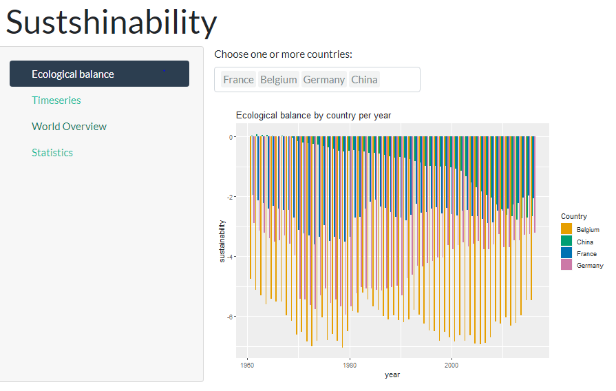

```{r setup, include=FALSE}
knitr::opts_chunk$set(echo = FALSE)
```

## Context

- Rise in ecological concerns 

- World leaders meetings to bring that topic further and take measures

- Heavy political discussions and debates dividing the population 


## Agenda

- Identified pain points
- Goals and Impact
- Data
- Sustainability App 
- Comparison of results
- Team


## Identfied pain points

- **Uneducated population:** Many aspects of sustainability are not well understood

- **Lack of transparency:** Not immediately obvious how our personal immediate actions fit the overall picture

- **Scattered data:** Sustainability data is scattered among all kinds of media in a "fuzzy" way.


## Goals

To address the above points and challenges, we want to create the S(ust)hinybility app based on a reliable database. This app 

- **gathers** worldwide data on carbon emissions 
 
- **exploits** the specific information by year and by country

- **provides** visualization to compare carbon emissions on a country (or region) level

## Impact

<div class="columns-2">
**First** the individuals are nudged to learn

**Second** making ecological footprints comparable

**Third** the interactive app helps to check facts and used against wrongly spread information 

- Increases knowledge and awareness

- Higher satisfaction of researchers 

- This increases data credibility

</div>


## Data

- *Source:* 2019 edition of the *National Footprint and Biocapacity Accounts*

- *Variables:* The (public) data set has 12 variables and provide information on 72,186 observations on 192 countries

- *Time frame:* 1961 - 2016

## Important terms

- **Ecological Footprint**

- **Biocapacity**

- **Carbon Footprint**


## Sustainability App 

- World Map Overview [Total]


## Ecological Balance (2)



## Statistics (3)


## Time Series (4)


## Comparison of results

- Best/Worst
- Timeseries 1961-2016 -> Evolution for each of the four countries
- Anomalies and Surprises: Chinas' growth, unexpected developments


## Limitations 

- **Project management:** Starting ideas too optimistic and not realistic for timeframe of class schedule

- **Data:** Generality of dataset, understanding of data and selection bias


## Learnings

- **(1)** Conversion of ideas into code is time consuming (and fixing errors or deleting websites)
- **(2)** GitHUb is quite useful for group projects and time-saving
- **(3)** The bottlenecks of projects are usually fixing errors and checking the package
- **(4)** To-Do lists and Github Projects help to track progress and have a clear view of the project

## Conclusion

- Improvements for package
- Achieved goal 

## Thank you for your attention

## Sources


